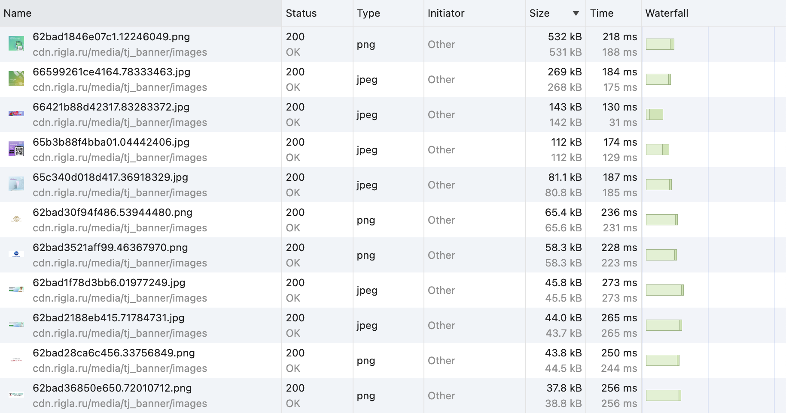

# SHRI-Tuling-Homework

## Network анализ

### Запись network - `./rigla-network.har`

### Дублирующиеся запросы

Запрос к graphql повторяется 9 раз.

### Лишний размер ресурса

JS скрипты имеют большой размер, т.к. не разбиты на chunks.
Стоит отметить, что в топе больших скриптов всего 2 написанных на сайте: `my-repices.js_t=2511940e` и
`chunk-07046ba1.js?_t=45c65d99`.
Наиболее большие скрипты приведены ниже.

Изображения имеют большой размер, т.к. используются неоптимизированный формат (как .png или .jpg).
Наиболее большие изображения также представлены ниже.

### Ресурсы блокирующие отображение

Ресурсы блокирующие отображение - `/js/app.js?_t=01971f7a` и `/js/chunk-vendors.js?_t=9f02fabd`

## Perfomance анализ

### Запись Perfomance - `./rigla-perfomance.json`

### Измерение времени от начала навигации до событий
 - DOM Content Loaded (DCL) - 456.2 ms
 - First Paint (FP) - 918.12 ms
 - First Contentful Paint (FCP) - 918.12 ms
 - Load (L) - 1178.8 ms
 - Largest Contentful Paint (LCP) - 1823.9 ms

### LCP
Largest Contentful Paint (LCP) происходит на изображении:

``

### Этапы обработки документа
 - Loading - 3 ms
 - Scripting - 408 ms
 - Rendering - 17 ms
 - Painting - 1 ms

## Coverage анализ

### Скриншот вкладки после открытия страницы

### Объем неиспользованного CSS
45.9 kB не использовано

### Объем неиспользованного JS
3.5 mB - 3584 kB не использовано

